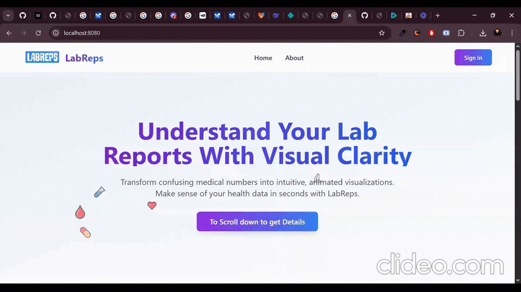

<div align="center">
  
  <h1>Lab Report Visualizer</h1>
</div>

<div align="center">
  <a href="https://reactjs.org/">
    
  </a>
  <a href="https://greensock.com/gsap/">
    
  </a>
  <a href="https://mui.com/">
    
  </a>
</div>

## Overview

The **Lab Report Visualizer** is a web application designed to transform complex lab reports into an intuitive, visually engaging experience. Built with the **Tata 1mg Catalyst** framework, this project utilizes the power of **React** for the user interface, enhanced with dynamic and meaningful animations powered by **GSAP (GreenSock Animation Platform)**. The goal is to make lab report data easier to understand, less daunting, and more informative for patients.

## Problem Addressed

Traditional lab reports can be confusing. The sheer volume of numbers, coupled with technical jargon, makes it difficult for patients to understand their health data. The lack of visual context and dynamic representation hinders comprehension and can lead to unnecessary anxiety.

## Solution

This application offers:

*   **Interactive Visualizations:**  Dynamic charts and graphs to represent key lab metrics (e.g., LDL Cholesterol, White Blood Cell Count).
*   **Meaningful Animations:** Animations that highlight key data points, trends, and deviations from normal ranges.
*   **Intuitive User Interface:** A clean, user-friendly design built to make the user's journey easier.
*   **Catalyst Integration:** Demonstrates key features like server-side rendering, routing, and data fetching using Catalyst's powerful capabilities.

## Features

*   **Report Types:** Currently supports:
    *   Lipid Profile
    *   CBC (Complete Blood Count)
*   **Data Visualization:** Animated bar graphs, trend lines, and value counters.
*   **Abnormality Highlighting:** Clear visual cues to indicate results outside the normal range.
*   **Trend Visualization:** View changes in metrics over time.
*   **Responsive Design:** Ensures a consistent experience across devices.
*   **Patient ID Input and Report Generation.**

## Tech Stack

*   **Framework:** Tata 1mg Catalyst (Inspired)
*   **UI Library:** React
*   **Animation Library:** GSAP (GreenSock Animation Platform)
*   **Styling:** CSS Modules
*   **Data Fetching:** Catalyst `serverFetcher`


## Deployment Link

[Live Demo](https://labreps.netlify.app/)




## Getting Started

1.  **Prerequisites:**
    *   Node.js (version 20.4.0 or later)
    *   npm or yarn

2.  **Installation:**

    ```bash
    # Clone the repository (if applicable)
    # git clone <repository-url>

    # Navigate to the project directory
    cd lab-report-visualizer

    # Install dependencies
    npm install  # Or yarn install
    ```

3.  **Running the Application:**

    ```bash
    npm run start # Starts the development server
    ```

    The application will be available at `http://localhost:3005` (or the port specified in your Catalyst configuration).

## Project Structure

```
lab-report-visualizer/
├── src/
│ ├── components/ # Reusable UI components
│ │ ├── Header/
│ │ ├── Footer/
│ │ ├── ReportVisualizer/
│ │ ├── MetricVisualizer/
│ │ ├── LoadingIndicator/
│ │ └── ...
│ ├── pages/ # Application pages
│ │ ├── Home/
│ │ ├── Report/
│ │ ├── About/
│ │ └── ...
│ ├── js/ # JavaScript specific files
│ │ ├── routes/
│ │ ├── utils/
│ │ │ ├── api.js # API calls
│ │ └── constants/
│ ├── static/ # Static assets (images, fonts, etc.)
│ ├── client/
│ └── server/ # Express server setup (for serving static assets and API)
├── mock-data/
│ ├── cbc-patient-123.json
│ ├── lipid-profile-patient-123.json
├── .env
├── package.json
└── README.md
```


## API Endpoints (Mock Data)

*   `/api/reports/user/:userId/:reportType` - Returns mock report data based on `userId` and `reportType`.

## Future Enhancements

*   Support for additional lab report types.
*   Integration with real lab data APIs.
*   Advanced animation effects and visualizations.
*   User authentication and personalized dashboards.

## License

[MIT License](LICENSE)